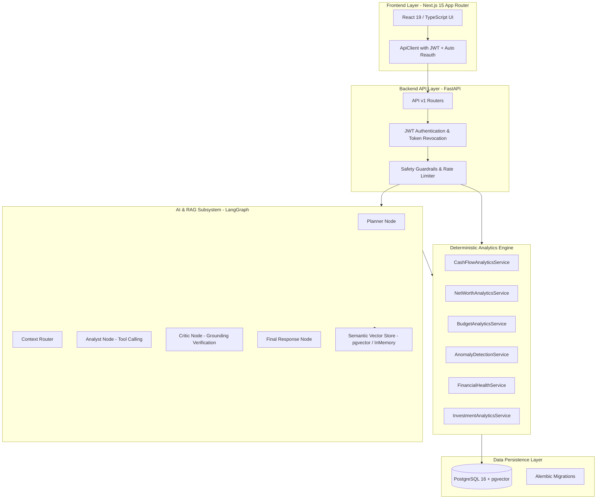
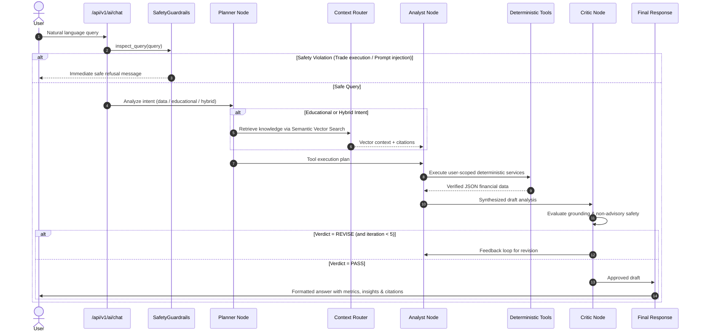

# FinPilot AI — AI-Powered Personal Financial Intelligence Platform

> **FinPilot AI** is a portfolio-grade full-stack personal financial intelligence platform and agentic AI analyst. Built with **FastAPI**, **Next.js 15 App Router**, **PostgreSQL + pgvector**, **SQLAlchemy 2.0 (Async)**, and a **LangGraph multi-agent reasoning graph**, FinPilot AI bridges deterministic accounting principles with conversational intelligence.

---

## 1. Overview

FinPilot AI provides individuals with automated ledger tracking, double-entry financial accounting, multi-period cash flow analytics, budget pace projections, investment portfolio breakdowns, and AI-driven insights. 

The application enforces a strict engineering invariant: **the LLM is never the source of financial truth**. All mathematical calculations (net worth, cash flow, debt-to-income, budget pace, statistical anomaly standard deviations) are computed deterministically in Python using exact numeric representations (`Decimal`), while the AI layer orchestrates tool retrieval, natural-language reasoning, and grounded educational explanation.

---

## 2. Problem & Solution

Most personal finance tools fall into either static spreadsheets without reasoning or generic chatbots that hallucinate financial arithmetic.

FinPilot AI solves this with a **deterministic-first, agentic-second architecture**:
- **Verified Double-Entry Ledger**: Exact numeric precision (`NUMERIC(18,2)`) and double-entry transfers (`transfer_account_id`).
- **Deterministic Analytics Engine**: 12 dedicated Python services compute cash flows, savings rates, spending distributions, goals, and statistical anomalies ($\mu + 2.5\sigma$).
- **LangGraph Multi-Agent AI Analyst**: A 5-node cyclic graph (Planner, Context Router, Analyst, Critic, Final Response) that calls backend tools and verifies grounding.
- **Curated Semantic RAG**: Verified financial knowledge retrieved from regulatory frameworks (CFPB, FDIC, SEC, AMFI) with zero-fabrication citations.
- **Layered Security Guardrails**: Pre-execution filters intercept prompt injection, trade execution requests, and guaranteed return inquiries.

---

## 3. Key Features

- **Multi-Account Cash Ledger**: Checking, savings, credit card, investment, and loan accounts with double-entry transfers.
- **Time-Series Cash Flow Analytics**: Daily, weekly, and monthly cash flow metrics with historical savings rate averages.
- **Budget Pace Projections**: Real-time spending pace detection flagging `ON_TRACK`, `WARNING`, and `OVER_BUDGET` categories.
- **Goal Milestone Monitoring**: Target date pace tracking and required monthly contribution formulas.
- **Portfolio Allocation & P&L**: Holdings cost basis, current valuation, and asset allocation breakdown.
- **Statistical Anomaly Detection**: Automatic flagging of unusual expenditures based on 90-day rolling baseline means and standard deviations ($\mu + 2.5\sigma$).
- **0–100 Financial Health Score**: 6-dimension weighted index (Savings, Budget Adherence, Liquidity Runway, Debt Burden, Goal Pace, Investments).
- **Agentic AI Analyst (LangGraph)**: Multi-turn conversational interface with tool execution badges, key metrics extraction, and verified citations.
- **CSV / Statement Importer**: File upload with SHA-256 deduplication and transaction category suggestions.
- **Financial Calculators**: Indian Income Tax (Old vs. New Regime AY 2025-26), FIRE target calculator, and Loan Prepayment interest saver.

---

## 4. System Architecture



---

## 5. Tech Stack

| Layer | Technologies |
|---|---|
| **Backend** | Python 3.13, FastAPI, SQLAlchemy 2.0 (Async), Pydantic v2, Alembic, Uvicorn |
| **Frontend** | Next.js 15 (App Router), React 19, TypeScript, Tailwind CSS, Lucide Icons |
| **AI / Multi-Agent** | LangGraph, LangChain Core, OpenAI API (`gpt-4o-mini`, `text-embedding-ada-002`) |
| **Database & Vector** | PostgreSQL 16, pgvector extension, SQLite / aiosqlite (in-memory test runner) |
| **Security & Auth** | OAuth2 Bearer JWT, PyJWT, Passlib (Bcrypt), Sliding-Window In-Memory Rate Limiting |
| **Testing & CI** | Pytest, Pytest-Asyncio, HTTPX AsyncClient, Next.js Build Compiler |
| **Containerization** | Docker, Docker Compose (Development & Production multi-stage configurations) |

---

## 6. AI & LangGraph Architecture



---

## 7. Educational RAG Knowledge Base

FinPilot AI includes 5 curated, verified markdown knowledge documents in `backend/knowledge/`:
1. `budgeting_fundamentals.md`: 50/30/20 rule, zero-based budgeting, and envelope methodology.
2. `debt_management.md`: Debt Avalanche vs. Debt Snowball strategies and Debt-to-Income (DTI) thresholds.
3. `emergency_funds.md`: 3–6 months essential expense runway and liquidity tiering.
4. `financial_health_and_goals.md`: SMART goal setting, savings rate targets, and net worth milestone planning.
5. `investing_basics_and_diversification.md`: Asset allocation, rupee-cost averaging (SIPs), and index fund diversification.

---

## 8. Financial Data Model & Precision

- All monetary columns in PostgreSQL use `NUMERIC(18, 2)` or `NUMERIC(18, 4)`.
- Python calculations strictly utilize `decimal.Decimal` with explicit rounding modes (`ROUND_HALF_UP`).
- Double-entry transfers maintain ledger integrity:
  - Source account balance: $-\text{Amount}$
  - Destination account balance: $+\text{Amount}$
  - Linked via `transactions.transfer_account_id`.

---

## 9. Security & Safety

1. **Authentication & Token Revocation**: JWT tokens include unique UUID identifiers (`jti`) checked against an in-memory revocation blacklist on logout.
2. **Cross-User Scoped Isolation**: Every repository query enforces `WHERE user_id = :user_id`. Direct object access across users returns `404 Not Found`.
3. **Sliding-Window Rate Limiting**: Per-user / per-IP rate limits protect `/auth`, `/ai/chat`, and `/imports/upload` against brute-force and resource exhaustion.
4. **Input Sanitization & Injection Defense**: Regex filters intercept adversarial prompts, system prompt override attempts, and unauthorized transaction requests.
5. **Non-Advisory Financial Disclaimer**: Every AI response includes a clear disclaimer that FinPilot AI provides personal financial analysis and education, not certified tax, legal, or investment advice.

---

## 10. REST API Reference

Full interactive OpenAPI documentation is available at `/api/v1/docs` in non-production environments.

Key route groups:
- `/api/v1/auth`: Registration, login, logout, user profile.
- `/api/v1/accounts`: Bank, credit, and investment accounts.
- `/api/v1/transactions`: Ledger entries, filtering, categorization, transfers.
- `/api/v1/analytics`: Cash flow, net worth, budgets, goals, anomalies, health score.
- `/api/v1/alerts`: Notification inbox and rule evaluation.
- `/api/v1/ai`: Chat endpoint, conversation threads, health probe.
- `/api/v1/imports`: Statement CSV upload, preview, and deduplication execution.
- `/api/v1/calculators`: Income tax, FIRE, and loan prepayment tools.
- `/health` & `/ready`: Liveness and database connectivity probes.

---

## 11. Local Development

### Prerequisites
- Python 3.11+ (Python 3.13 supported)
- Node.js 18+ & npm
- PostgreSQL 16 with pgvector (or SQLite for testing)

### Backend Setup
```bash
cd backend
python -m venv venv
# Linux/macOS: source venv/bin/activate
# Windows: .\venv\Scripts\activate

pip install -r requirements.txt
pytest -v
uvicorn app.main:app --reload --port 8000
```

### Frontend Setup
```bash
cd frontend
npm install
npm run build
npm run dev
```

The web dashboard is available at `http://localhost:3000` and the API at `http://localhost:8000`.

---

## 12. Environment Variables

Copy `.env.example` to `.env`:

```bash
cp .env.example .env
```

| Variable | Description | Default |
|---|---|---|
| `ENVIRONMENT` | Runtime environment (`development`, `test`, `production`) | `development` |
| `SECRET_KEY` | JWT signing secret (min 32 chars in production) | `dev_secret_key_...` |
| `DATABASE_URL` | PostgreSQL asyncpg connection string | `postgresql+asyncpg://...` |
| `SYNC_DATABASE_URL` | PostgreSQL psycopg string for Alembic | `postgresql://...` |
| `CORS_ORIGINS` | Comma-separated list of allowed web origins | `http://localhost:3000` |
| `LLM_PROVIDER` | LLM provider (`mock`, `openai`) | `mock` |
| `LLM_API_KEY` | OpenAI API Key (required when `LLM_PROVIDER=openai`) | `""` |
| `EMBEDDING_PROVIDER` | Embedding provider (`mock`, `openai`) | `mock` |

---

## 13. Docker Deployment

### Development
```bash
docker compose up --build
```

### Production
```bash
docker compose -f docker-compose.prod.yml up --build -d
```

---

## 14. Testing Suite

The repository includes a comprehensive 95-test automated test suite covering ledger integrity, multi-user isolation, analytics math, LangGraph multi-agent nodes, vector RAG retrieval, and AI safety guardrails.

```bash
cd backend
pytest -v
```

---

## 15. Project Structure

```text
finpilot-ai/
├── .env.example                     # Environment configuration template
├── README.md                        # Master project documentation
├── docker-compose.yml               # Local development multi-container orchestration
├── docker-compose.prod.yml          # Production multi-container orchestration
├── docs/                            # Deep-dive architectural documentation
│   ├── ai_architecture.md           # AI layer and guardrails
│   ├── api.md                       # Complete REST API reference
│   ├── architecture.md              # Core backend architecture
│   ├── financial_methodology.md     # Mathematical formulas and scoring algorithms
│   └── langgraph_architecture.md    # Multi-agent graph state and topology
├── backend/                         # FastAPI application
│   ├── Dockerfile                   # Backend container specification
│   ├── alembic/                     # Database migrations (0001–0005)
│   ├── app/
│   │   ├── ai/                      # LangGraph agents, RAG, and tools
│   │   ├── api/                     # REST routes and dependency injection
│   │   ├── core/                    # Security, rate limiting, and config
│   │   ├── db/                      # SQLAlchemy models and session handling
│   │   ├── repositories/            # Data access layer
│   │   ├── schemas/                 # Pydantic v2 request/response models
│   │   └── services/                # Deterministic financial analytics services
│   ├── knowledge/                   # Curated educational markdown documents
│   ├── requirements.txt             # Python dependencies
│   └── tests/                       # 30 test modules (95 passing tests)
└── frontend/                        # Next.js 15 Web Application
    ├── Dockerfile                   # Frontend container specification
    ├── src/
    │   ├── app/                     # Next.js App Router (20 routes)
    │   ├── components/              # Reusable UI components
    │   ├── features/                # Feature-specific components
    │   ├── hooks/                   # Custom React hooks
    │   ├── lib/                     # API client and utility functions
    │   └── types/                   # TypeScript interfaces and schemas
    ├── package.json                 # Frontend dependencies and build scripts
    └── tsconfig.json                # TypeScript compiler configuration
```

---

## 16. Limitations

1. **Market Data Feeds**: Investment valuations currently reflect user-recorded purchase prices and manually updated market values rather than real-time live stock/crypto ticker websocket feeds.
2. **Bank Aggregation APIs**: Bank statement imports operate via CSV/statement file uploads rather than direct live Plaid/Yodlee/Account Aggregator open banking connections.
3. **In-Memory Rate Limiting & Blacklist**: The current token blacklist and rate limiter operate in server process memory. Multi-instance horizontal scaling would benefit from a Redis backend.

---

## 17. Future Improvements

- **Redis Caching & Distributed Revocation**: Transition sliding-window rate limiting and revoked JWT blacklist to Redis.
- **Direct Open Banking / Account Aggregator Integration**: Support automated bank feed sync via standard Account Aggregator (AA) APIs.
- **Export Formats**: Support PDF and XLSX financial report downloads.

---

## 18. License

This project is open-source under the MIT License.
